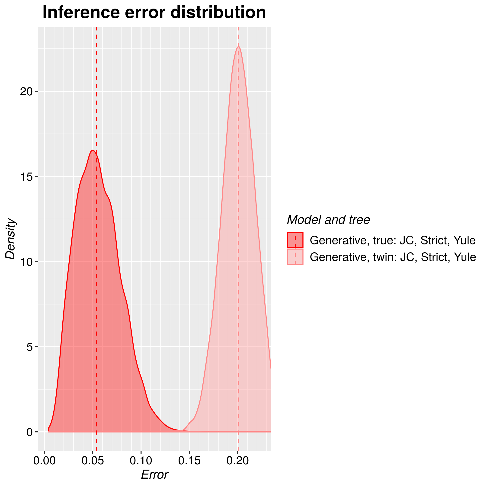
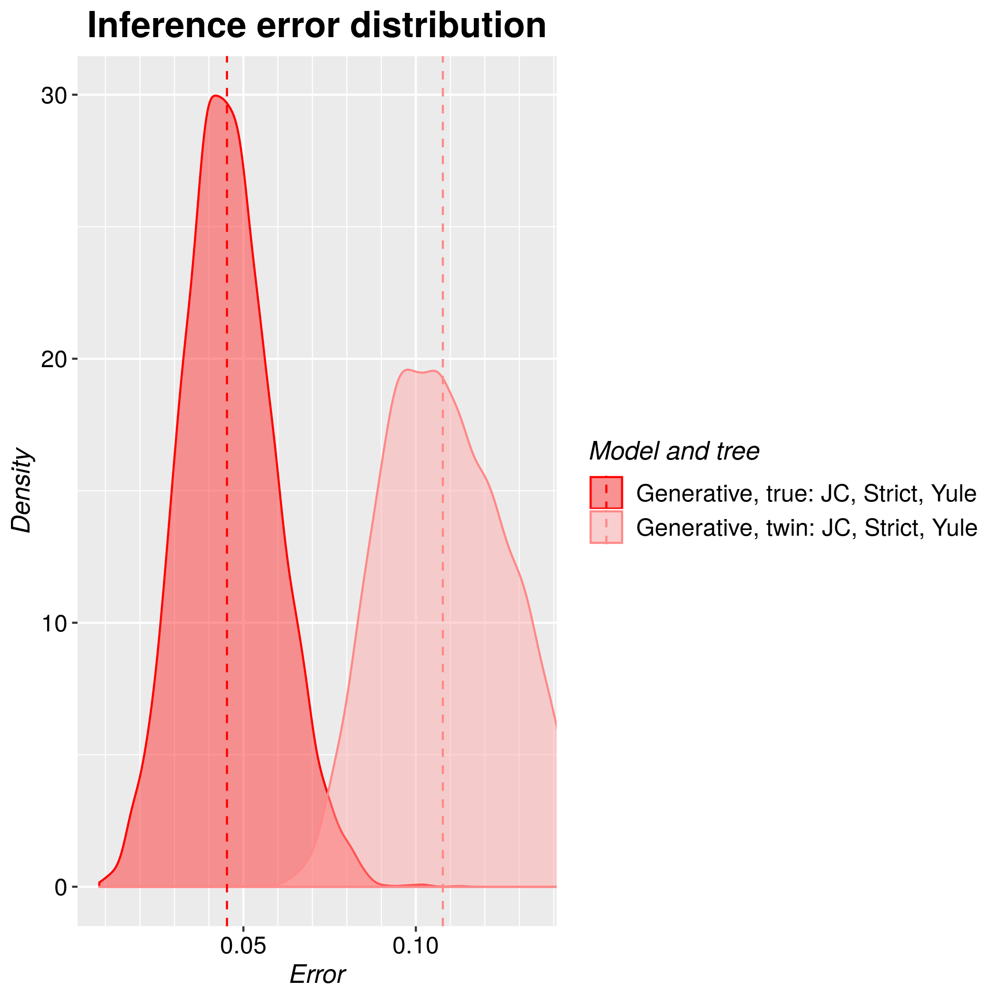
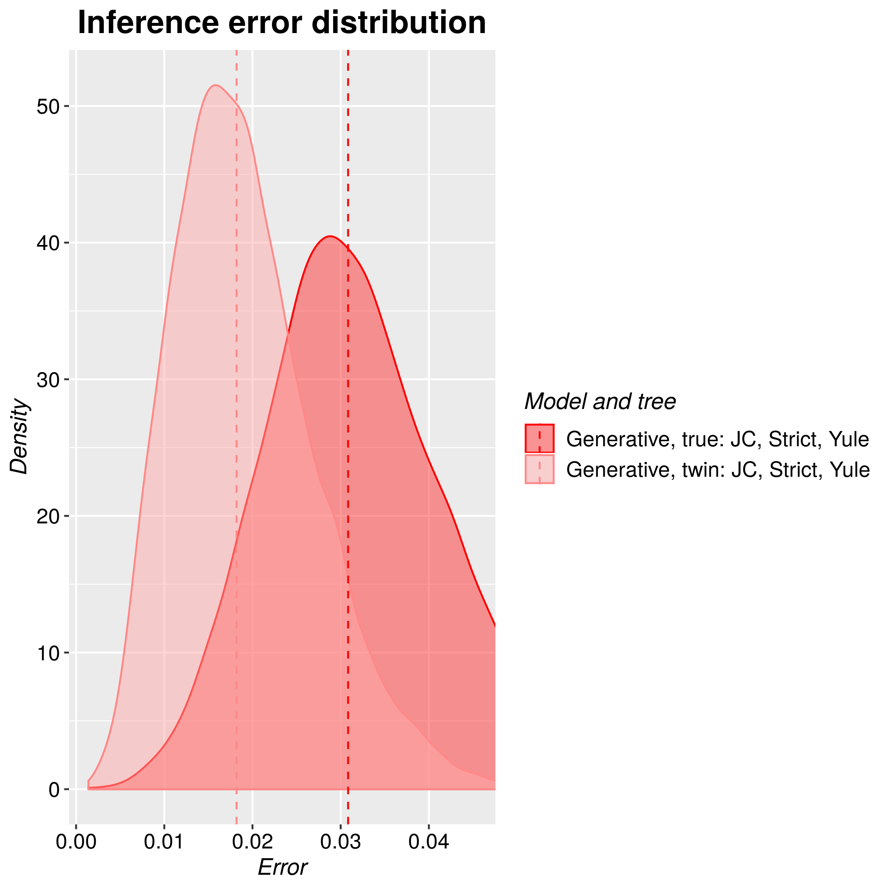

# pirouette_example_9

Branch   |
---------|---------------------------------------
`master` |
`develop`|

A [pirouette example](https://github.com/richelbilderbeek/pirouette_examples).

## Results

